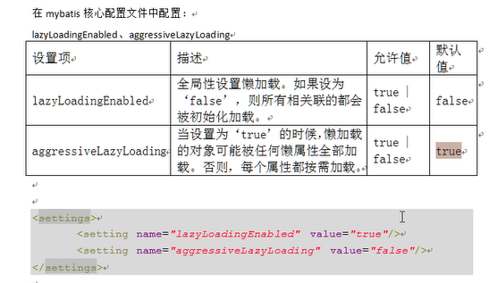

### 延时加载

resultMap可以实现高级映射（使用association、collection实现一对一及一对多映射），**association、collection具备延迟加载功能。**

需求：
如果查询订单并且关联查询用户信息，如果先查询订单信息即可满足要求，当我们需要查询用户信息时再查询用户信息。
把对用户信息的按需取去查询就是延迟加载。

延迟加载：先从单表查询、需要时再从关联表去关联查询，大大提高数据库性能，因为查询单表要比关联查询多表速度要快。

### 第一步：config的配置中开启懒加载功能
```xml
    <settings>
       <!--是否开启懒加载-->
       <setting name="lazyLoadingEnabled" value="true"/>
       <!--是否开启积极加载-->
       <setting name="aggressiveLazyLoading" value="false"/>
    </settings>
```



### 第一步：定义mapper.xml
需要定义两个mapper的方法对应的statement。

1、只查询订单信息
select * from orders
在查询订单的statement中使用association去延时加载下面的statement（关联查询用户信息）
```xml
    <select id="findOrdersUserLazyLoading" resultMap="OrderUserlazyLoadingResultMap" >
        select * from orders
    </select>
```

2、关联查询用户信息
    通过上边查询到的订单信息中user_id去关联查询用户信息
```xml
  <select id="findUserById"  parameterType="int"  resultType="com.shi.bean.User">
      select * from user where id = #{value}
  </select>  
```

完整的mapper.xml文件：
    
```xml
<?xml version="1.0" encoding="UTF-8" ?>
<!DOCTYPE mapper PUBLIC "-//mybatis.org//DTD Mapper 3.0//EN" "http://mybatis.org/dtd/mybatis-3-mapper.dtd">
<mapper namespace="com.shi.mapping.UserMapperI">

    <!--延迟加载的resultMap-->
    <resultMap id="OrderUserlazyLoadingResultMap" type="com.shi.pojo.OrderResultMap">
        <!--对订单信息进行映射配置-->
        <id column="id" property="ID"/>
        <result column="user_id" property="userID"/>
        <result column="number" property="mNumber"/>
        <result column="note" property="mNote"/>
        <!-- 实现对用户信息的延时加载
        select：指定延迟加载需要执行的statement的ID（是根据user_id查询用户信息的statement）
        column：订单信息中关联用户信息查询的列，是user_id,关联查询的sql理解为：
            SELECT orders.*
            , (SELECT username FROM USER WHERE orders.`user_id` = user.`id`)username
            , (SELECT sex FROM USER WHERE orders.`user_id` = user.id)sex
            FROM orders
        -->
        <!--用户信息-->
        <association property="mUser" javaType="com.shi.bean.User" select="com.shi.mapping.UserMapperI.findUserById" column="user_id">

        </association>
    </resultMap>

    <select id="findUserById"  parameterType="int"  resultType="com.shi.bean.User">
        select * from user where id = #{value}
    </select>

    <select id="findOrdersUserLazyLoading" resultMap="OrderUserlazyLoadingResultMap" >
        select * from orders
    </select>
</mapper>
```    
在上面的mapper.xml文件中，使用association中的select指定延迟加载去执行的statement的id。
    
### 第三步：OrderCustomI对象
```java
public interface OrderCustomI {
    public List<OrderResultMap> findOrdersUserLazyLoading();
    public List<User> findUserById(int id);
}
```
### 第四步：调用OrderCustomI.findOrdersUserLazyLoading();实现懒加载

```java
public class OrderCustomITest {

    SqlSession sqlSession;
    @Before
    public void setUp() throws Exception {
        sqlSession = MyBatisUtil.getSqlSession();
    }

    @After
    public void tearDown() throws Exception {
        sqlSession.close();
    }

    @Test
    public void findOrdersUserLazyLoading() {
        OrderCustomI userMapperI = sqlSession.getMapper(OrderCustomI.class);
        List<OrderResultMap> listData = userMapperI.findOrdersUserLazyLoading();
        for (OrderResultMap data:listData) {
            System.out.println(data.getID()+"");
        }
    }
}
```
```


