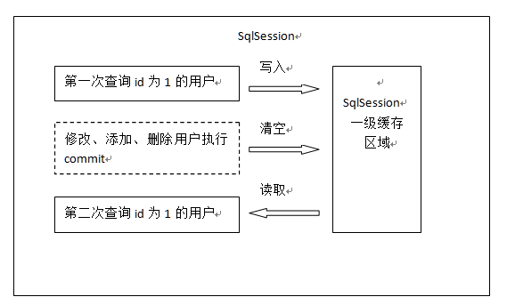
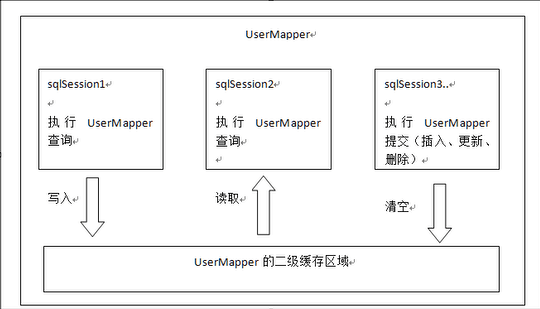

### 查询缓存：
 mybatis提供查询缓存，用于减轻数据压力，提高数据库性能。
 mybatis提供一级缓存和二级缓存
 
 
 
 1、一级缓存是sqlSession级别的缓存。在操作数据库时需要构造sqlSession对象，在对象中有一个数据结构（HashMap）
 用于存储缓存数据。不同的sqlSession之间缓存数据区域（HashMap）是互不影响的。
 
 2、二级缓存是mapper级别的缓存，多个sqlSession去操作同一个Mapper的sql语句，多个SqlSession可以共用二级缓存，
 二级缓存是跨SqlSession的。
 
 为什么要用缓存？如果缓存中有数据就不需要从数据库中获取，大大提高系统性能。
 
 ### 一级缓存
 
 一级缓存区域是根据SqlSession为单位划分的。每次查询先从缓存区域找，如果找不到从数据库查询，查询到数据将数据写入缓存。
 MyBatis内部存储缓存使用一个HashMap，key为hashCode+sqlId+Sql语句。value为从查询出映射生成的java对象
 
 举例说明：
 
 下图是根据id查询用户的一级缓存图解：
 
  
 
 
第一次发起查询用户id为1的用户信息，先去找缓存中是否有id为1的用户信息，如果没有，从数据库查询用户信息。
得到用户信息，将用户信息存储到一级缓存中。

如果sqlSession去执行commit操作（执行插入，更新，删除），清空SqlSession中的一级缓存，这样做的目的是为了让缓存中
存储的是最新信息，避免脏读。

第二次发起查询用户id为1的用户信息，先去找缓存中是否有id为1的用户信息，缓存中有，直接从缓存中获取用户信息。


### 一级缓存测试
  
mybatis默认支持以及缓存，不需要在配置文件中去配置

 ```java
 public class UserMapperITest {
 
     SqlSession sqlSession;
 
     @Before
     public void setUp() throws Exception {
         sqlSession = MyBatisUtil.getSqlSession();
     }
 
     @After
     public void tearDown() throws Exception {
         sqlSession.close();
     }
 
     @Test
     public void testCache() {
         //这里初次请求从数据库获取数据，并把数据插入到sqlSession的缓存中
         UserMapperI userMapperI = sqlSession.getMapper(UserMapperI.class);
         List<User> listData = userMapperI.findUserById(2);
         for (User user : listData) {
             user.toString();
         }
         //由于之前的请求把数据插入到了缓存中，这里从缓存中获取数据
         List<User> listData2 = userMapperI.findUserById(2);
     }
 
     @Test
     public void testCacheByCommit() {
         //这里初次请求从数据库获取数据，并把数据插入到sqlSession的缓存中
         UserMapperI userMapperI = sqlSession.getMapper(UserMapperI.class);
         List<User> listData = userMapperI.findUserById(2);
         for (User user : listData) {
             user.toString();
         }
         //这里主动调用sqlSession的commit方法，清空当前sqlSession的缓存
         sqlSession.commit();
         //由于调用了commit清空了数据缓存，这里请求的数据是从数据库获取的
         List<User> listData2 = userMapperI.findUserById(2);
     }
 }

```

正式开发，是将mybatis和spring进行整合开发，事务控制在service中。一个service方法中包括很多mapper方法调用。
一个service方法中包括了很多mappper方法调用。
service{
    //开始执行时，开启事务，创建sqlSession对象
    //第一次调用mapper的方法findUserById(1)
    
   //第二次调用mapper的方法findUserById(1)，从一级缓存中获取数据
   //方法结束，sqlSession关闭
}
**如果是执行两次Service调用查询相同的用户信息，不走一级缓存，因为session方法结束，sqlSession就关闭，一级缓存就清空。**


 ### 二级缓存
 
 
 
 首先开启mybatis的二级缓存。
 
 sqlSession1去查询用户id为1的用户信息，查询到用户信息会将查询数据存储到二级缓存中。
 
 如果sqlSession3去执行相同mapper下sql，执行commit提交，清空该mapper下的二级缓存区域的数据。
 
 sqlSession2去查询用户id为1的用户信息，去缓存中找是否存在数据，如果存在直接从缓存中去除数据。
 
 二级缓存与一级缓存区别，二级缓存范围更大，多个sqlSession可以共享一个UserMapper的二级缓存区域。
 UserMpper有一个二级缓存区域（按namespace分），其他mapper也有自己的二级缓存区域。
 每一个namespace的mapper都有一个二级缓存区域，两个mapper的namespace如果相同，这两个mapper执行sql查询
 到数据将存在相同的二级缓存区域中。
 
 
 1、开启二级缓存
 
 mybatis的二级缓存是mapper范围级别，除了在sqlMapConfig.xml设置二级缓存的总关系，还要在具体的mapper.xml中开启二级缓存。
 
 在核心配置文件SqlMapConfig.xml中加入<setting name="cacheEnabled" value="true"/>
 
|         | 描述          | 允许值  |  默认值|
| ------------- |:-------------:| -----:| -----:|
| cacheEnabled | 对在此配置文件下的所有cache进行全局性开/关设置| true/false| true |
 
 
 
 
 
 
 
 
 
 
 
 
 
 
 
 
 
 
 
 
 
 
 
 
 
