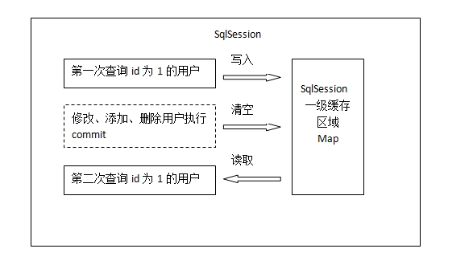
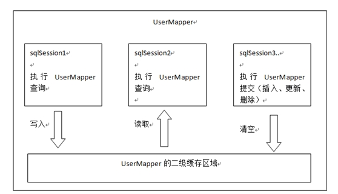
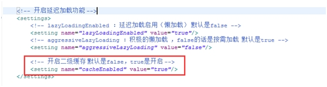
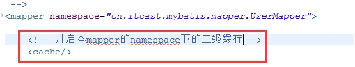
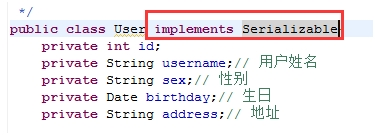
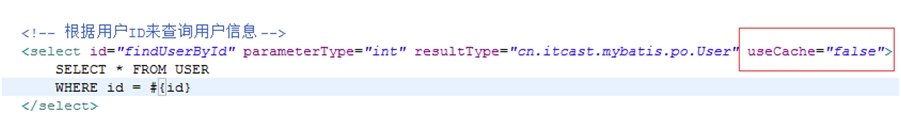
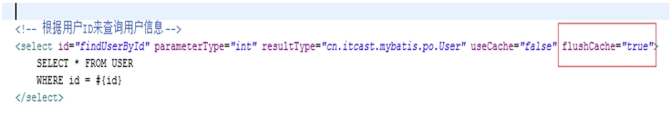
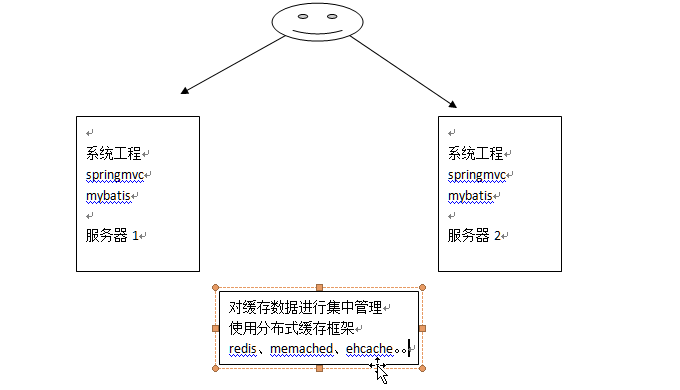
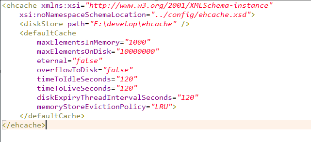

#### 什么是延迟加载 

resultMap中的association和collection标签具有延迟加载的功能。

延迟加载的意思是说，在关联查询时，利用延迟加载，先加载主信息。使用关联信息时再去加载关联信息。


#### 设置延迟加载

需要在SqlMapConfig.xml文件中，在<settings>标签中设置下延迟加载。

lazyLoadingEnabled、aggressiveLazyLoading

|   设置项      | 描述          | 允许值  |  默认值|
| ------------- |:-------------:| -----:| -----:|
| lazyLoadingEnabled | 全局性设置懒加载。如果设为‘false’，则所有相关联的都会被初始化加载。/true | false| false |
| aggressiveLazyLoading | 当设置为‘true’的时候，懒加载的对象可能被任何懒属性全部加载。否则，每个属性都按需加载。/true | false| false |

```xml
<!-- 开启延迟加载 -->
<settings>
    <!-- lazyLoadingEnabled:延迟加载启动，默认是false -->
    <setting name="lazyLoadingEnabled" value="true"/>
    <!-- aggressiveLazyLoading：积极的懒加载，false的话按需加载，默认是true -->
    <setting name="aggressiveLazyLoading" value="false"/>
     
    <!-- 开启二级缓存，默认是false -->
    <setting name="cacheEnabled" value="true"/>
</settings>
```
#### 什么是查询缓存

- Mybatis的一级缓存

是指SqlSession。一级缓存的作用域是一个SqlSession。Mybatis默认开启一级缓存。
在同一个SqlSession中，执行相同的查询SQL，第一次会去查询数据库，并写到缓存中；第二次直接从缓存中取。当执行SQL时两次查询中间发生了增删改操作，则SqlSession的缓存清空。


- Mybatis的二级缓存

是指mapper映射文件。二级缓存的作用域是同一个namespace下的mapper映射文件内容，多个SqlSession共享。Mybatis需要手动设置启动二级缓存。
在同一个namespace下的mapper文件中，执行相同的查询SQL，第一次会去查询数据库，并写到缓存中；第二次直接从缓存中取。当执行SQL时两次查询中间发生了增删改操作，则二级缓存清空。

- 一级缓存原理



 一级缓存区域是根据SqlSession为单位划分的。
 每次查询会先去缓存中找，如果找不到，再去数据库查询，然后把结果写到缓存中。Mybatis的内部缓存使用一个HashMap，key为hashcode+statementId+sql语句。Value为查询出来的结果集映射成的java对象。
 SqlSession执行insert、update、delete等操作commit后会清空该SQLSession缓存。
 
- 二级缓存原理


 
 二级缓存是mapper级别的。Mybatis默认是没有开启二级缓存。
 
 第一次调用mapper下的SQL去查询用户信息。查询到的信息会存到该mapper对应的二级缓存区域内。
 第二次调用相同namespace下的mapper映射文件中相同的SQL去查询用户信息。会去对应的二级缓存内取结果。
 如果调用相同namespace下的mapper映射文件中的增删改SQL，并执行了commit操作。此时会清空该namespace下的二级缓存。
 
#### 开启二级缓存
1、在核心配置文件SqlMapConfig.xml中加入以下内容（开启二级缓存总开关）：
cacheEnabled设置为 true

 
 
2、在映射文件中，加入以下内容，开启二级缓存：
 
 
 
#### 实现序列化

 由于二级缓存的数据不一定都是存储到内存中，它的存储介质多种多样，所以需要给缓存的对象执行序列化。
 如果该类存在父类，那么父类也要实现序列化。



#### 禁用二级缓存
 
该statement中设置userCache=false可以禁用当前select语句的二级缓存，即每次查询都是去数据库中查询，默认情况下是true，即该statement使用二级缓存。
 
 
 
 #### 刷新二级缓存
 
  
 

#### 分布式缓存

- mybatis整合ehcache

ehcache是一个分布式缓存框架。

- 我们系统为了提高系统并发，性能、一般对系统进行分布式部署（集群部署方式）



不使用分布式缓存，缓存的数据在各个服务器单独存储，不方便系统开发。所以要使用分布式缓存对缓存数据进行集中管理。
mybatis无法实现分布式缓存，需要和其他分布式缓存框架进行整合。
 
 mybatis提供了一个cache接口，如果要实现自己的缓存逻辑，实现cache接口开发即可。
 mybatis和ehcache整合，mybatis和ehcache整合包中提供了一个cache接口的实现类。
 
 ```java
public interface Cache {
    String getId();

    void putObject(Object var1, Object var2);

    Object getObject(Object var1);

    Object removeObject(Object var1);

    void clear();

    int getSize();

    ReadWriteLock getReadWriteLock();
}
```
mybatis默认实现的cache是org.apache.ibatis.cache.impl.PerpetualCache类

- 加入ehcache包，整合ehcache相关jar包

ehcache-core-2.6.8.jar
mybatis-ehcache-1.0.3.jar
slf4j-api-1.6.1.jar

配置mapper中cache中的type为cache接口的实现类型。

```xml
<mapper namespace="com.shi.mapping.UserMapperI">

    <!--开启本Mapper的namespace下的二级缓存
     type：指定cache接口的实现类的类型，mybatis默认使用PerpetualCache，要和ehcache整合，
     如果要整合其他第三方缓存框架，需要配置type为ehcache实现cache接口的类型
    -->
    <cache type="org.mybatis.caches.ehcache.EhcacheCache"/>

</mapper>
```

加入eache的配置文件：



#### 二级缓存应用场景：

对于访问多的查询请求且用户对查询结果实时性要求不高，此时可采用mybatis二级缓存技术降低
数据库访问量，提高访问速度，业务场景如：耗时较高的统计分析sql、电话账单查询sql等、
实现方法如下：通过设置刷新间隔时间，由mybatis每隔一段时间自动清空缓存，根据数据变化频率设置
刷新间隔flushInterval,比如设置为30分钟、60分钟、24小时等，根据需要而定

#### 二级缓存局限性

mybatis二级缓存对细粒度的数据级别的缓存实现不好，比如如下需求：对商品信心进行缓存，由于商品信息
查询访问量大，但是要求用户每次都能查询最新的商品信息，此时如果使用mybatis的二级缓存就无法实现当一个
商品变化时只刷新该商品的缓存信息而不刷心其他商品的信息，因为mybatis的二级缓存区域以mapper为单位划分，当
一个商品信息变化会将所有商品信息的缓存数据全部清空。解决此类问题需要在业务层根据需求对数据有
针对性缓存


 
